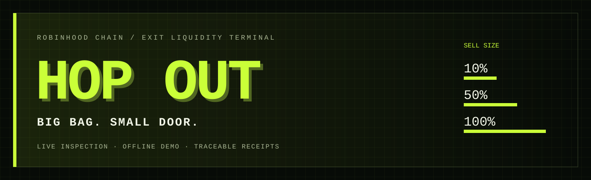
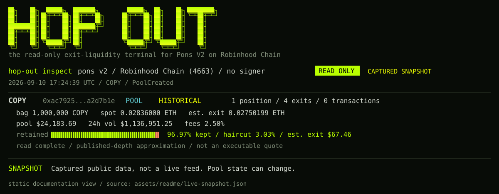
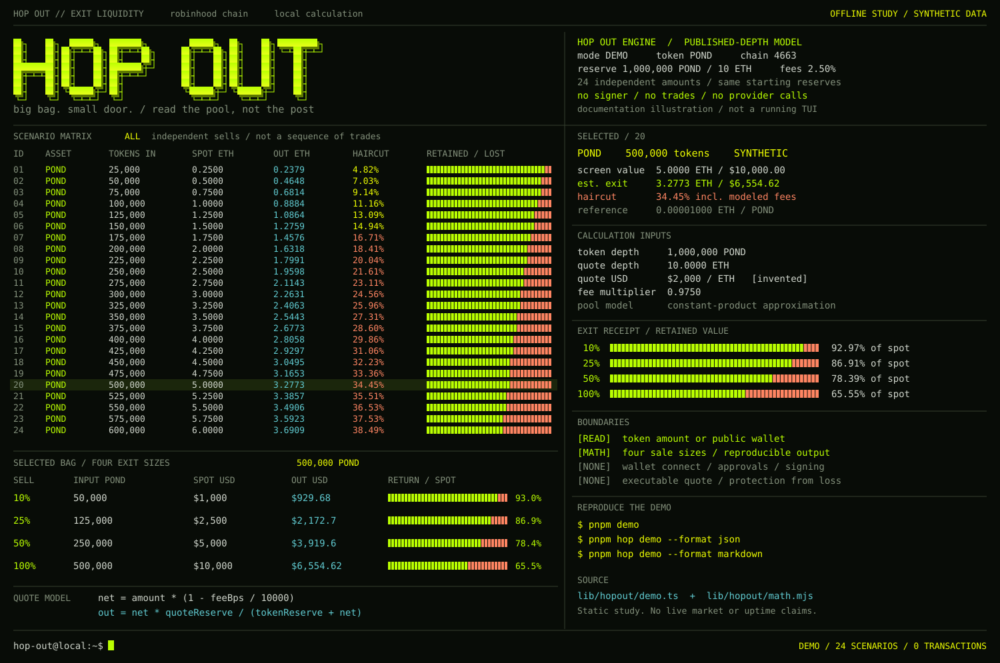
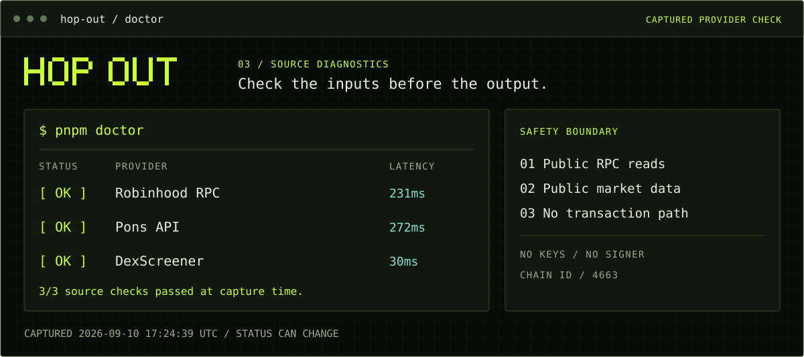
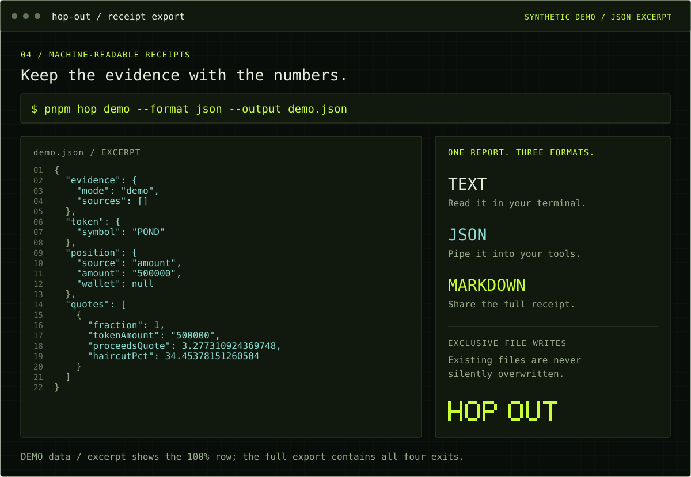
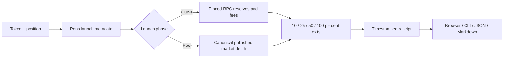

<p align="center"></p>
<p align="center"></p>

<p align="center">
  <a href="https://github.com/insomnia-vip/hop-out/actions/workflows/ci.yml"></a>
  
  
  
  <a href="LICENSE"></a>
</p>

<p align="center"><strong>Measure the exit before the jump.</strong><br/>A browser and local CLI for inspecting Pons V2 exit liquidity on Robinhood Chain.</p>
<p align="center"><a href="https://hopout.xyz">Website</a> · <a href="https://hopout.xyz/terminal">Terminal</a> · <a href="https://hopout.xyz/docs">Docs</a> · <a href="https://x.com/insomnia_vip">X / Twitter</a></p>
<p align="center"><a href="#start-in-one-minute">Start locally</a> · <a href="#holder-check">Holder Check</a> · <a href="#live-inspection">Live inspection</a> · <a href="docs/COMMANDS.md">Commands</a> · <a href="docs/METHODOLOGY.md">Methodology</a> · <a href="docs/ARCHITECTURE.md">Architecture</a></p>

## Why HOP OUT

A wallet multiplies your bag by the last traded price. A pool prices the entire sale. Those two numbers can be very different.

HOP OUT takes a token and position, then measures the difference at **10%, 25%, 50%, and 100%** of the bag. The frog is the meme; the exit receipt is the product.

### Read the pool, not the post



A styled documentation view of an actual CLI result. The capture time is printed inside the image; it is a historical estimate, not a current quote. [Full captured data →](assets/readme/live-snapshot.json)

## Available in the current source

| Surface | What works |
| --- | --- |
| Browser terminal | Amount or public wallet → four exit estimates → receipt |
| Holder Check | Optional EVM address connection → official `$HOPOUT` balance → holder receipt; waits for a verified CA |
| Local CLI | `inspect`, `demo`, `doctor`; no web server required |
| Offline walkthrough | Synthetic POND example, labelled DEMO, no provider requests |
| Exports | JSON for scripts, Markdown for a readable receipt |
| Curve engine | Block-pinned reserve and fee reads; separate on-chain fee rounding |
| Graduated pool | Canonical published depth with an explicit approximation label |
| Verification | Provider fixtures, input checks, CLI tests, Node 22/24 CI configuration |

HOP OUT is available at [hopout.xyz](https://hopout.xyz) with the browser terminal, documentation, offline demo and local CLI ready to use. The project-token Holder Check activates when a verified `$HOPOUT` contract address is configured; until then, its clearly labelled synthetic receipt demonstrates the complete flow.

### Holder Check

Open `/holders` in a local build to request an account from an injected EVM wallet. The browser sends only the selected public address to HOP OUT; there is no signature, approval, network switch or transaction request. After the official contract is published, configure it server-side:

```bash
HOPOUT_CONTRACT_ADDRESS=0x... pnpm dev
```

The holder receipt reads the wallet's token balance, calculates the same four independent exit sizes, and can show estimated exit P&L only when the holder supplies a USD cost basis. Cost basis is never inferred.

Before the contract is configured, **View example receipt** opens a visibly labelled synthetic holder result. Its wallet, balance, price, depth and P&L are invented solely to demonstrate the interface.

## Start in one minute

Install Node.js 22.13+ and pnpm 11.19.0, then:

```bash
git clone https://github.com/insomnia-vip/hop-out.git
cd hop-out
pnpm install --frozen-lockfile
pnpm demo
```

`demo` compiles the CLI and prints a reproducible, synthetic exit receipt. It does not fetch live data.

### Same bag. Four different jumps.



A static terminal-style study using the offline demo's reserves and calculation engine. The 24 rows are independent hypothetical sale sizes, not trades or a live feed. Lime shows estimated proceeds relative to spot; orange shows the difference. The selected 500,000 POND bag reproduces `pnpm demo`. This dense layout is documentation artwork, not an additional interactive CLI mode.

Open the web terminal with:

```bash
pnpm dev
```

Visit `http://localhost:5173` for the project landing page, then open `/terminal` to run the exit-liquidity tool or `/holders` for the optional holder flow. Use **OFFLINE DEMO** or enter a real contract and position.

## Live inspection

COPY is a supported example, not the HOP OUT contract:

```bash
pnpm hop inspect --token 0xac79255f6f404eba14f316e8669d76573a2d7b1e --amount 1000000
```

The receipt near the top shows a captured run of this command. Run it again for a fresh snapshot; live prices, depth and fees can change.

To inspect a public balance instead of a manually entered amount:

```bash
pnpm hop inspect --token <TOKEN_ADDRESS> --wallet <PUBLIC_WALLET>
```

### Check the sources



The doctor checks public provider responses and the RPC chain ID. These are measured results from the printed capture time, not a continuous uptime monitor. [Captured checks →](assets/readme/doctor-snapshot.json)

```bash
pnpm doctor
```

## Receipts that travel



The same report can be read in a terminal, consumed as JSON, or shared as Markdown. The picture shows an excerpt of the real demo schema; the complete export includes all four sale sizes.

```bash
pnpm hop inspect --token <TOKEN_ADDRESS> --amount 1000000 --format json --output receipt.json
pnpm hop demo --format markdown --output demo.md
```

Exports refuse to overwrite existing files. [Full command reference →](docs/COMMANDS.md)

## How it works



On the curve, Pons' sell formula uses virtual-plus-real pricing reserves. HOP OUT checks real trading reserves and subtracts separately rounded base and creator fees. Contract reads share one block number.

After graduation, the engine approximates execution using the Pons-designated pool's published depth. It does not reconstruct Uniswap v4 ticks. The receipt discloses a 1% platform-fee assumption plus reported creator and LP fees. Missing canonical depth produces an explicit error.

The haircut is the difference between spot value and estimated proceeds, including modeled fees. [Formulas, sources, limitations →](docs/METHODOLOGY.md)

## Project map

```text
bin/hop-out.mjs          CLI commands and exclusive exports
lib/hopout/
  quote.ts              Shared live engine and provider reads
  math.mjs              Integer curve / published-depth math
  input.ts              Shared validation and error mapping
  project-token.ts      Verified $HOPOUT contract configuration gate
  demo.ts               Isolated synthetic example
  receipt.ts            Plain-text and Markdown rendering
app/                    Browser terminal, Holder Check and API
assets/                 Wordmark, terminal illustrations and source captures
public/                 Pixel frog mascot
docs/                   Methodology, commands, testing and launch kit
test/                   Deterministic fixtures and CLI tests
.github/workflows/      Cross-version CI
```

## API and development

`POST /api/quote` accepts `{ "token": "0x…", "amount": "1000000" }` or `wallet` instead of `amount`. `GET /api/holder` reports whether the official contract is configured; `POST /api/holder` accepts only a public `wallet` address and remains unavailable until that contract is verified. Responses include the method, source URLs, observation time and available block/pool identifiers. `GET /api/health` checks Pons availability.

```bash
pnpm check
```

See [testing](docs/TESTING.md), [contributing](CONTRIBUTING.md), [changelog](CHANGELOG.md), and [security](SECURITY.md). WebMCP registration is included for compatible browsers; the core UI and CLI do not depend on it.

The terminal images are documentation illustrations of existing outputs, not separate dashboard modes. [Reproduce or refresh the images →](assets/readme/README.md)

## Boundaries and sources

HOP OUT holds no keys and has no transaction path. The optional Holder Check requests only a public EVM address. Estimates exclude gas, MEV and future state changes. It is not an executable quote, tax record, or proof that a token is safe.

Built against public [Pons Portal data](https://www.ponsportal.fun/docs.html), [Pons V2 contracts](https://github.com/ponsdotdev/ponsfamily/tree/main/contractsV2), [Robinhood Chain](https://docs.robinhood.com/chain/) and [DexScreener](https://docs.dexscreener.com/api/reference). Independent of these services. MIT — see [LICENSE](LICENSE).
