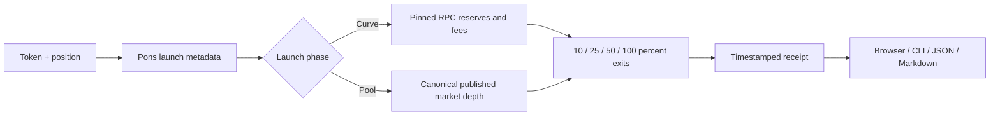

<p align="center"></p>
<p align="center"></p>

<p align="center">
  <a href="https://github.com/insomnia-vip/hop-out/actions/workflows/ci.yml"></a>
  
  
  
  <a href="LICENSE"></a>
</p>

<p align="center"><strong>Measure the exit before the jump.</strong><br/>A browser and local CLI for inspecting Pons V2 exit liquidity on Robinhood Chain.</p>
<p align="center"><a href="#start-in-one-minute">Start</a> · <a href="#live-inspection">Live inspection</a> · <a href="docs/COMMANDS.md">Commands</a> · <a href="docs/METHODOLOGY.md">Methodology</a> · <a href="docs/ARCHITECTURE.md">Architecture</a></p>

## Why HOP OUT

A wallet multiplies your bag by the last traded price. A pool prices the entire sale. Those two numbers can be very different.

HOP OUT takes a token and position, then measures the difference at **10%, 25%, 50%, and 100%** of the bag. The frog is the meme; the exit receipt is the product.

## Available in v0.2

| Surface | What works |
| --- | --- |
| Browser terminal | Amount or public wallet → four exit estimates → receipt |
| Local CLI | `inspect`, `demo`, `doctor`; no web server required |
| Offline walkthrough | Synthetic POND example, labelled DEMO, no provider requests |
| Exports | JSON for scripts, Markdown for a readable receipt |
| Curve engine | Block-pinned reserve and fee reads; separate on-chain fee rounding |
| Graduated pool | Canonical published depth with an explicit approximation label |
| Verification | Provider fixtures, input checks, CLI tests, Node 22/24 CI configuration |

The [hosted preview](https://hop-out-rh.nikitaguguman.chatgpt.site) currently requires owner access. Anyone can run the repository locally. No HOP OUT token contract has been deployed by this repository.

## Start in one minute

Install Node.js 22.13+ and pnpm 11.19.0, then:

```bash
git clone https://github.com/insomnia-vip/hop-out.git
cd hop-out
pnpm install --frozen-lockfile
pnpm demo
```

`demo` compiles the CLI and prints a reproducible, synthetic exit receipt. It does not fetch live data. Open the web terminal with:

```bash
pnpm dev
```

Visit `http://localhost:5173`. Use **EXPLORE OFFLINE DEMO** or enter a real contract and position.

## Live inspection

COPY is a supported example, not the HOP OUT contract:

```bash
pnpm hop inspect --token 0xac79255f6f404eba14f316e8669d76573a2d7b1e --amount 1000000
pnpm doctor
```

An observed result from **2026-09-10 17:09:13 UTC** (historical, not a current quote):

```text
LIVE / COPY / Published pool-depth estimate
Position: 1,000,000 COPY
Screen value: 0.02997 ETH ($73.34)
Est. exit:   0.02905822 ETH ($71.1088)

Sell       Haircut
10%          2.54%
25%          2.62%
50%          2.76%
100%         3.04%
```

Inspect a public balance or export the same report:

```bash
pnpm hop inspect --token <TOKEN_ADDRESS> --wallet <PUBLIC_WALLET>
pnpm hop inspect --token <TOKEN_ADDRESS> --amount 1000000 --format json --output receipt.json
pnpm hop demo --format markdown --output demo.md
```

Exports refuse to overwrite existing files. [Full command reference →](docs/COMMANDS.md)

## How it works



On the curve, Pons' sell formula uses virtual-plus-real pricing reserves. HOP OUT checks real trading reserves and subtracts separately rounded base and creator fees. Contract reads share one block number.

After graduation, the engine approximates execution using the Pons-designated pool's published depth. It does not reconstruct Uniswap v4 ticks. The receipt discloses a 1% platform-fee assumption plus reported creator and LP fees. Missing canonical depth produces an explicit error.

The haircut is the difference between spot value and estimated proceeds, including modeled fees. [Formulas, sources, limitations →](docs/METHODOLOGY.md)

## Project map

```text
bin/hop-out.mjs          CLI commands and exclusive exports
lib/hopout/
  quote.ts              Shared live engine and provider reads
  math.mjs              Integer curve / published-depth math
  input.ts              Shared validation and error mapping
  demo.ts               Isolated synthetic example
  receipt.ts            Plain-text and Markdown rendering
app/                    Browser terminal and read-only API
assets/                 Original HOP OUT wordmark
public/                 Pixel frog mascot
docs/                   Methodology, commands, testing and launch kit
test/                   Deterministic fixtures and CLI tests
.github/workflows/      Cross-version CI
```

## API and development

`POST /api/quote` accepts `{ "token": "0x…", "amount": "1000000" }` or `wallet` instead of `amount`. Responses include the method, source URLs, observation time and available block/pool identifiers. `GET /api/health` checks Pons availability.

```bash
pnpm check
```

See [testing](docs/TESTING.md), [contributing](CONTRIBUTING.md), [changelog](CHANGELOG.md), and [security](SECURITY.md). WebMCP registration is included for compatible browsers; the core UI and CLI do not depend on it.

## Boundaries and sources

HOP OUT holds no keys and has no transaction path. Estimates exclude gas, MEV and future state changes. It is not an executable quote or proof that a token is safe.

Built against public [Pons Portal data](https://www.ponsportal.fun/docs.html), [Pons V2 contracts](https://github.com/ponsdotdev/ponsfamily/tree/main/contractsV2), [Robinhood Chain](https://docs.robinhood.com/chain/) and [DexScreener](https://docs.dexscreener.com/api/reference). Independent of these services. MIT — see [LICENSE](LICENSE).
